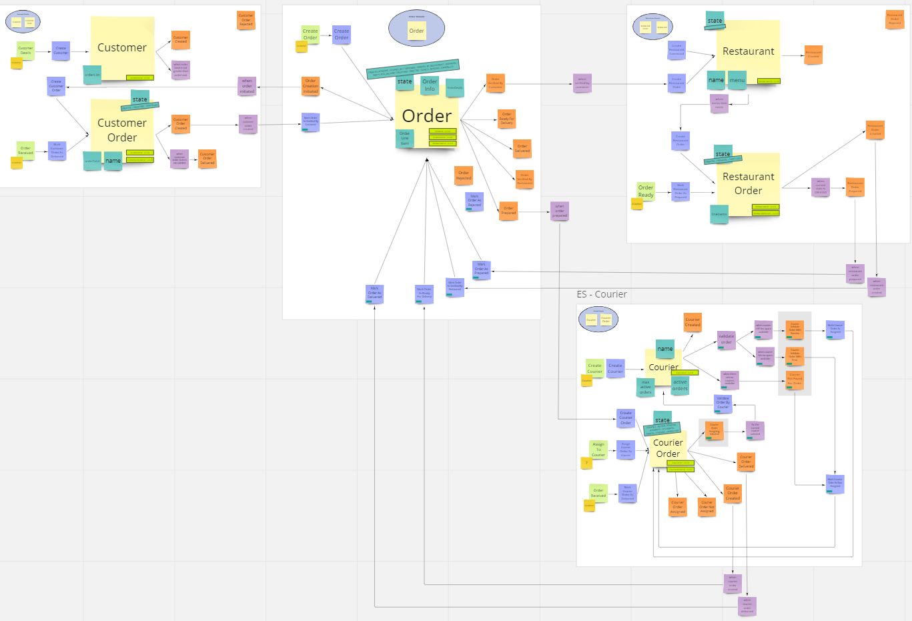

# PratoFeito

O PratoFeito é um clone simplificado do iFood, criado com o objetivo de fornecer uma plataforma intuitiva e conveniente para fazer pedidos de comida online. Este projeto representa uma excelente oportunidade para aprender e aprimorar habilidades de programação, ao mesmo tempo em que serve como um ponto de partida para projetos mais complexos. Inspirado nas [lives](https://www.youtube.com/watch?v=6BfJb7RPW-o&list=PLs-l5bSgIMhBDOtatiLQXeNarcdeaekZI&index=10) do [Lucas Gertel](https://github.com/lgertel), onde ele desenvolveu uma aplicação similar em Kotlin e explorou abordagens diferentes, você pode conferir a estrutura proposta para o projeto no seguinte [link](https://miro.com/app/board/uXjVMR2I6DI=/).

# Tecnologias usadas

* [ASP.NET 6](https://learn.microsoft.com/en-us/aspnet/core/introduction-to-aspnet-core?view=aspnetcore-6.0)
* [Entity Framework Core 7](https://learn.microsoft.com/pt-br/ef/core/)
* [MediatR](https://github.com/jbogard/MediatR)
* [AutoMapper](https://automapper.org/)
* [FluentValidation](https://fluentvalidation.net/)
* [Postgres](https://www.postgresql.org/)
* [Docker](https://www.docker.com/)
* [Dapper](https://github.com/DapperLib/Dapper)

# Visão geral dos contextos

## Customer
O contexto "cliente" do PratoFeito é responsável por gerenciar as funcionalidades relacionadas aos clientes. Algumas das principais funcionalidades incluídas são:

1. Cadastro de clientes: o contexto permite o cadastro de novos clientes, com informações básicas como nome, sobrenome e limite de valor para pedidos.
2. Gerenciamento de contas: os clientes podem gerenciar suas contas, alterando informações de perfil, como nome, sobrenome e limite de valor para pedidos.
3. Histórico de pedidos: o contexto mantém um histórico de todos os pedidos realizados por um cliente, permitindo que ele visualize o status de cada um deles.

## Order

## Restaurant

## Courier

# Como executar o projeto
Para executar o PratoFeito, siga as instruções abaixo:

## Foto do projeto no miro 

# Licença
O PratoFeito é distribuído sob a licença MIT. Para mais informações, consulte o arquivo LICENSE neste repositório.
Espero que isso ajude! Se você tiver mais dúvidas, sinta-se à vontade para perguntar.